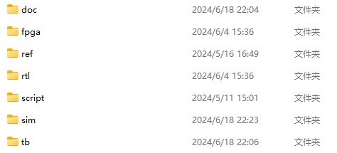

# MultiPortCache

2024集创赛-中科芯杯

## 目录结构

- **doc**: 存放文档
- **fpga**: 存放fpga工程(目前已经ignore掉，后面会用tcl脚本管理)
- **ref**: 参考内容(目前已经ignore掉)
- **rtl**: rtl设计代码
- **script**: 存放使用的各种脚本
- **sim**: 存放模块的仿真
- **tb**: 验证平台 